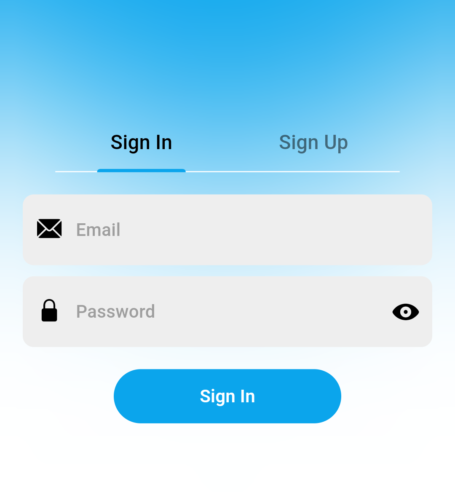
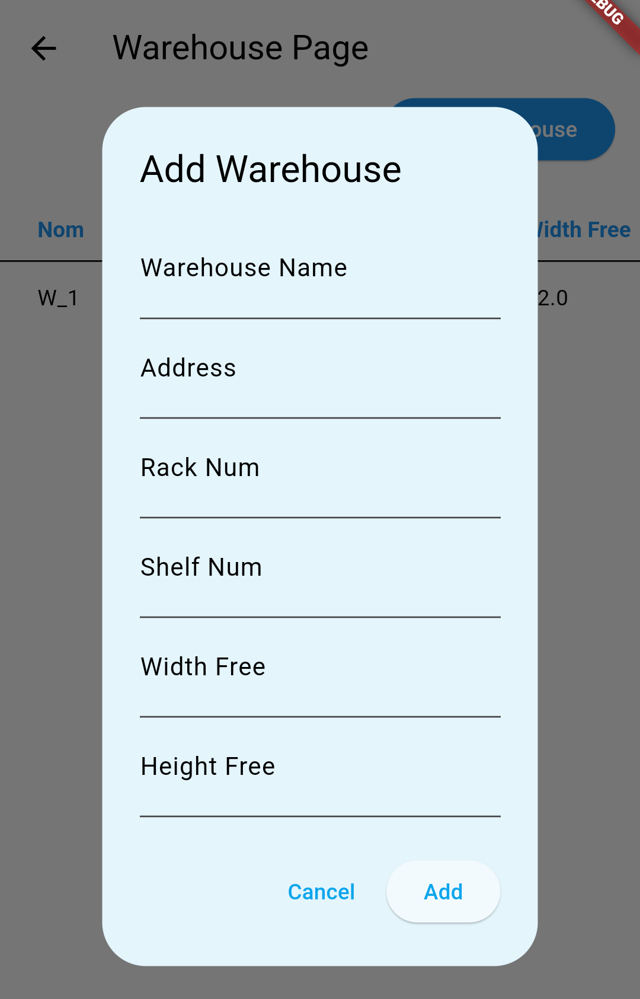
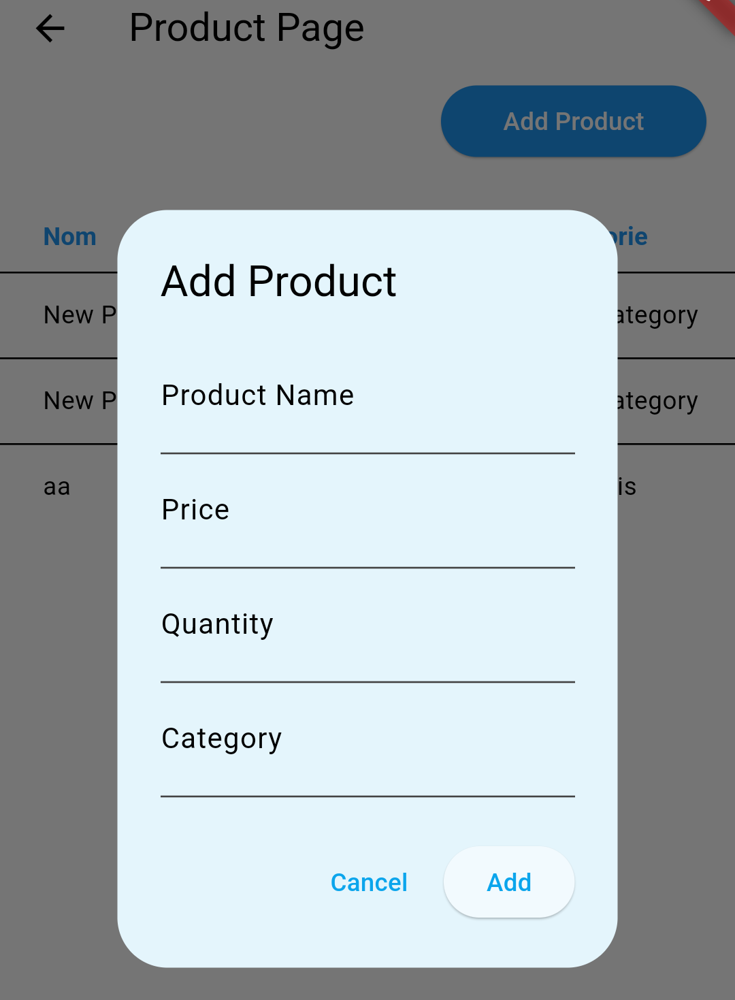
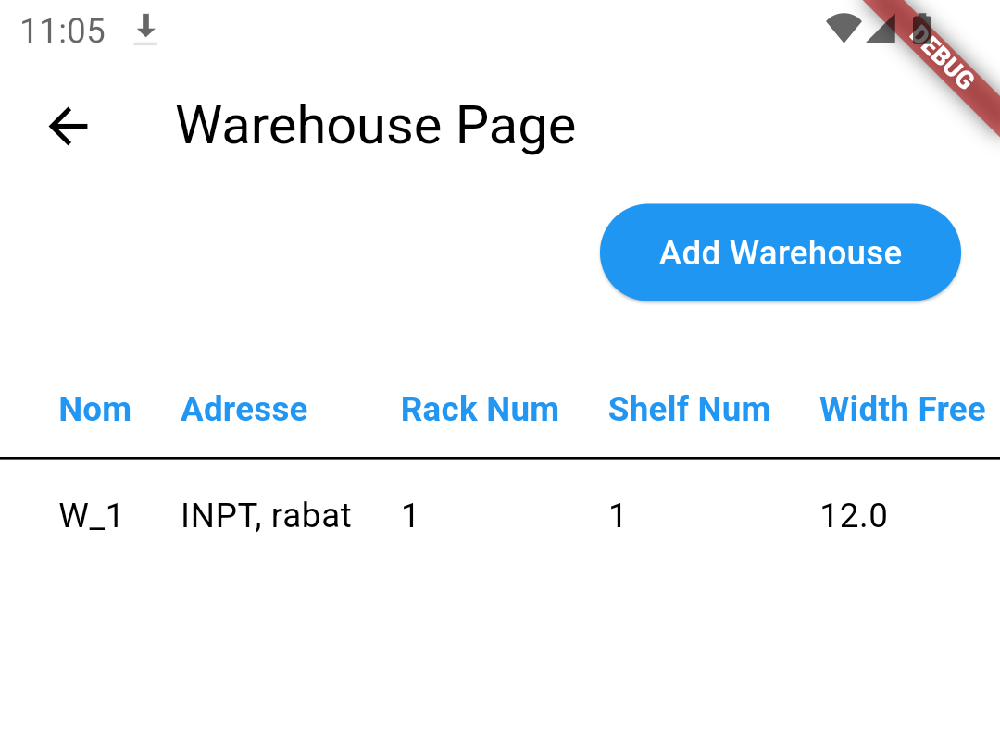
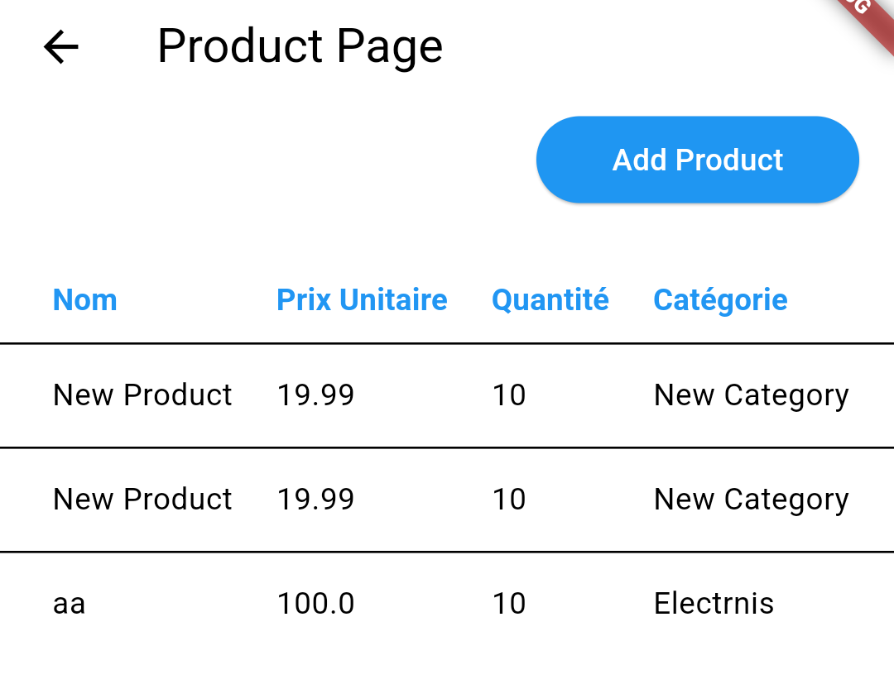
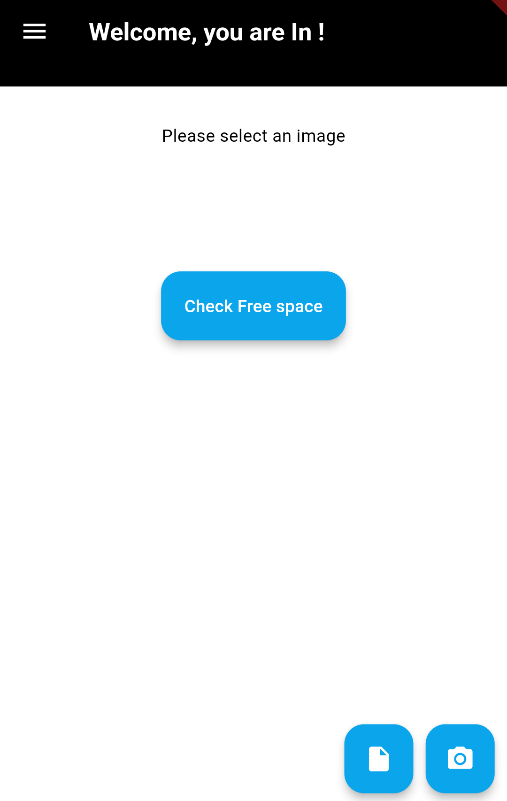
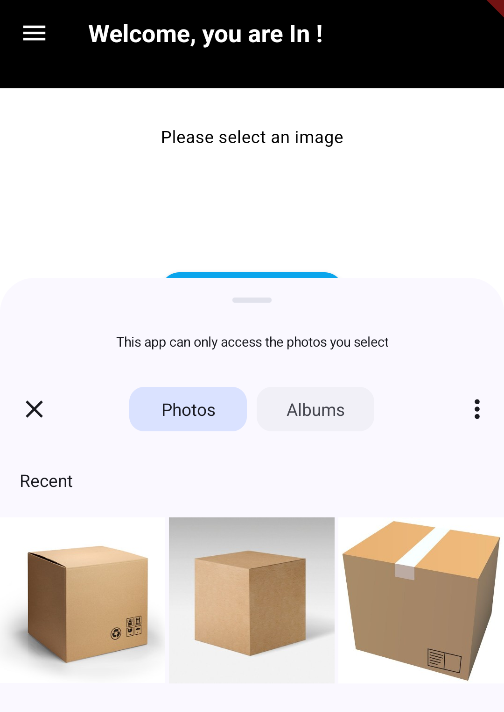
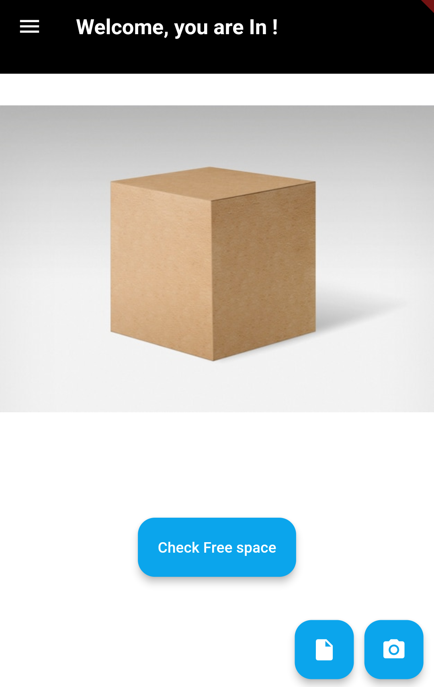
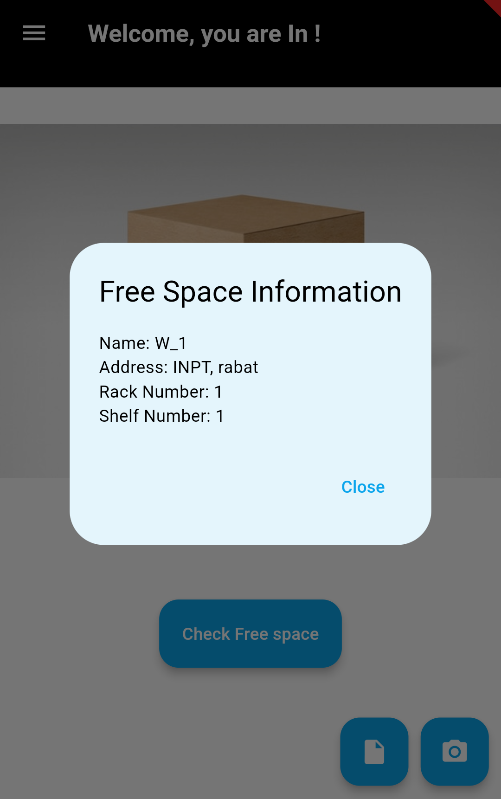

<h2>Project Screenshots:</h2>
  
  
  
  
  
  
  
  
  
  
<h2>🧐 Features</h2>

Here're some of the project's best features:

*   Import Warehouse Data
*   List Warehouse Data
*   Import or Take a picture of the product
*   Calculate the Product Dimensions
*   Compare the Product Dimensions with the Free space
*   Display the Coordinates of the Free Space

  
  
<h2>💻 Built with</h2>

Technologies used in the project:

*   Flutter
*   Firebase
*   Deep Learning(YOLOv8)
